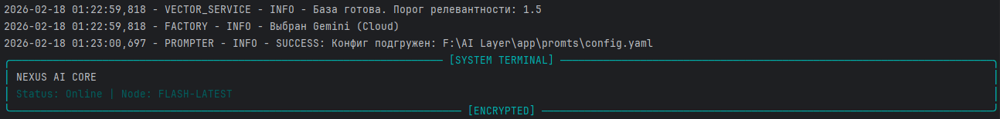
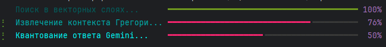

# 🛰️ NEXUS AI CORE v3.0
### [Architect's Autonomous PDA & Knowledge Engine]


**NEXUS** — это высокопроизводительная RAG-система (Retrieval-Augmented Generation), спроектированная как автономный терминал для анализа сложных технических сред. Система позволяет «скармливать» ей любую техническую документацию, чертежи или спецификации кода для мгновенного получения контекстных ответов.

---

## 💎 Почему NEXUS? (Core Value)

* **🚀 Документация в реальном времени:** Просто закиньте PDF, TXT или файлы кода в `/inbox`. Система проиндексирует их в векторную базу данных за секунды.
* **🔧 Мульти-доменный анализ:** От архитектуры игровых движков и оптимизации кэша до стандартов Revit, Solidworks и низкоуровневого программирования.
* **🛡️ Промышленная отказоустойчивость:** Если Cloud API (Gemini) недоступен или квоты исчерпаны (429 Error), ядро автоматически переключает вычисления на локальную **Ollama (Qwen2.5-Coder)**.
* **🛰️ Terminal UX:** Профессиональный интерфейс на базе `Rich`, имитирующий работу полевого инженерного КПК.

---

## 🏗️ Архитектурный стек (SOLID)

Система построена на принципах строгой ответственности:
1.  **AI Providers:** Гибридная модель (Gemini + Ollama) через абстрактную фабрику.
2.  **Vector Core:** ChromaDB для семантического поиска смыслов, а не просто ключевых слов.
3.  **Config Engine:** Строгое управление окружением через `.env` и централизованный конфиг.

---

## 📸 Интерфейс системы

| Инициализация и авто-загрузка | Анализ документации и RAG |
| :--- | :--- |
|  |  |

---

## ⚙️ Быстрый старт

1. Склонируйте репозиторий.
2. Создайте `.env` (см. файл `.env.example`) и добавьте свои API ключи.
3. Разместите любую тех. документацию в папку `inbox/`.
4. Запустите:
```bash
python main.py